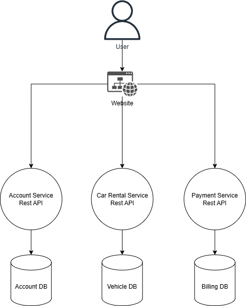

# 

## **Design Considerations for Microservices**
1. **Loosely Coupled Architecture**  
   - Each microservice (e.g., User Management, Vehicles, Reservations, Payments) is designed to function independently, minimizing dependencies between services.  
   - Services interact through well-defined APIs to ensure changes in one service do not impact others.

2. **Domain-Driven Design**  
   - Microservices are organized around core business domains, such as Account Management, Vehicle Management, Booking/Reservations, and Billing/Payments.  
   - This ensures each service encapsulates its domain logic, making the system modular and easier to maintain.

3. **API-First Development**  
   - All communication between services is handled through RESTful APIs.  
   - APIs are versioned (e.g., `/v1`) to ensure backward compatibility as services evolve.

4. **Independent Deployability**  
   - Services can be updated, deployed, or rolled back independently, minimizing downtime.

5. **Security Best Practices**  
   - Sensitive data, like passwords, is hashed using bcrypt.  
   - Confidential credentials are securely stored using environment variables.  

---

## **Architecture Diagram**


---

## **Instructions**

### **Setting Up and Running Microservices**
1. **Configure Environment Variables**  
   - Add a `.env` file to the root folder of `accountService` and `paymentService` with the following variables:  
     ```
     GMAIL_EMAIL=your-email@gmail.com  
     GMAIL_APP_PASSWORD=your-app-password  
     ```

2. **Enable CORS**  
   - Download [Moesif Origin/CORS Changer & API Logger](https://chromewebstore.google.com/detail/moesif-origincors-changer/digfbfaphojjndkpccljibejjbppifbc) from the Chrome Web Store.  
   - Enable CORS to allow CRUD operations to work on the frontend during development/testing.

3. **Set Up the Database**  
   - Create a database account by running the following commands in MySQL:  
     ```sql
     CREATE USER 'user'@'localhost' IDENTIFIED BY 'password';
     GRANT ALL ON *.* TO 'user'@'localhost';
     ```
     - An account named `user` with the password `password` is created.  
     - This account is granted full permissions on the database.

4. **Seed the Databases**  
   - Use the provided `seed.sql` script to create and populate the databases in MySQL.

5. **Run the Application**  
   - Open your terminal, navigate to the root directory of the entire project, and run:  
     ```
     start.bat
     ```
   - This will start all the microservices and the frontend locally.

6. **Use the Correct Browser**  
   - If the application opens in Microsoft Edge, copy the localhost link, close Edge, and paste the link into Chrome for better compatibility with the CORS extension.

---

### **Demo Account Credentials**
- **All demo account passwords:** `Password123`  
- **Note:** Remember to turn off CORS after testing or when development is complete.

---
